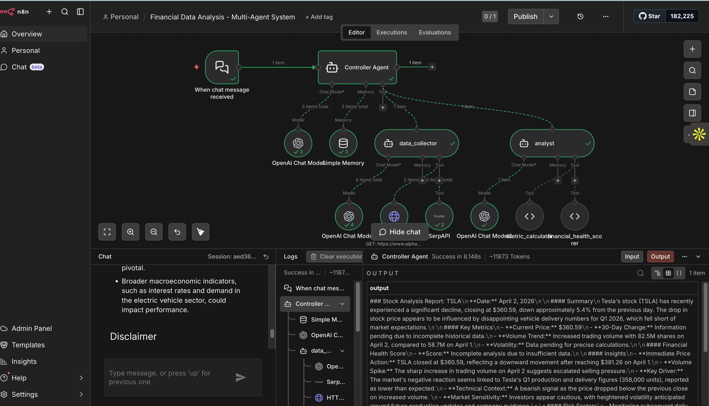

# Financial Data Analysis - Multi-Agent System (n8n Cloud)

A multi-agent financial data analysis system built on n8n Cloud. Users send stock analysis queries via chat, and a team of AI agents collaboratively fetches data, computes metrics, and returns structured investment reports.

## Workflow in Action



## Architecture Overview

```
[Chat Trigger]
      |
      v
[Controller Agent] -- Memory (Simple Memory)
      |                Model (OpenAI GPT)
      |
      +-- Tool: [Data Collector Agent]
      |         |-- Model (OpenAI GPT)
      |         |-- Tool: HTTP Request (Alpha Vantage API)
      |         +-- Tool: SerpAPI (Financial News Search)
      |
      +-- Tool: [Analyst Agent]
                |-- Model (OpenAI GPT)
                |-- Tool: Code - Metric Calculator
                +-- Tool: Code - Financial Health Scorer (Custom)
```

## Agents

| Agent | Role | Type |
|-------|------|------|
| Controller Agent | Orchestrator - receives queries, delegates to sub-agents, formats final report | AI Agent (main) |
| Data Collector | Fetches stock prices from Alpha Vantage API and financial news via SerpAPI | AI Agent Tool (sub-agent) |
| Analyst | Processes raw data, calculates metrics, generates health scores and insights | AI Agent Tool (sub-agent) |

## Tools

| Tool | Category | Used By | Description |
|------|----------|---------|-------------|
| HTTP Request | Data Retrieval | Data Collector | Calls Alpha Vantage API for daily stock price data |
| SerpAPI | Web Search | Data Collector | Searches for recent financial news and sentiment |
| Metric Calculator | Data Processing (Code) | Analyst | Computes moving averages, % changes, volatility, volume trends |
| Financial Health Scorer | Custom Tool (Code) | Analyst | Composite scoring algorithm (0-100) based on momentum, volatility, volume, and sentiment |

## Custom Tool: Financial Health Scorer

A custom-built composite scoring tool that evaluates stock health on a 0-100 scale using four weighted factors:

- **Price Momentum (30%)** - Based on 30-day percentage change
- **Volatility (25%)** - Based on standard deviation of daily returns (lower = better)
- **Volume Trend (20%)** - Evaluates buying/selling pressure relative to price direction
- **Sentiment (25%)** - Based on news sentiment analysis

**Ratings:**
- 70-100: Strong
- 45-69: Moderate
- 0-44: Weak

## Prerequisites

- [n8n Cloud account](https://app.n8n.cloud) (free trial available)
- OpenAI API key (or use n8n's free credits)
- [Alpha Vantage API key](https://www.alphavantage.co/support/#api-key) (free - 25 requests/day)
- [SerpAPI key](https://serpapi.com/) (free tier - 100 searches/month)

## Setup Instructions

### Option 1: Import Workflow (Recommended)

1. Log into your n8n Cloud instance
2. Go to **Workflows** > **Add workflow**
3. Click the **three dots menu (...)** in the top right > **Import from File**
4. Select `financial_analysis_workflow.json` from this repository
5. Configure your API credentials:
   - Open the **HTTP Request** node > update the `apikey` query parameter with your Alpha Vantage key
   - Open the **SerpAPI** node > set up your SerpAPI credential
   - Open each **OpenAI Chat Model** node > set up your OpenAI credential (or use n8n free credits)
6. Click **Save** then **Execute Workflow**
7. Click **Open Chat** to start querying

### Option 2: Build from Scratch

Follow the step-by-step build guide in [docs/build-guide.md](docs/build-guide.md).

## Usage

Open the chat interface and try queries like:

```
Analyze Tesla stock performance and give me insights
```
```
What's the current state of AAPL stock?
```
```
Compare the health of GOOGL stock - is it a good time to invest?
```
```
Give me a risk analysis for MSFT
```

## Sample Output

```
### Stock Analysis Report: TSLA
**Date:** April 2, 2026

#### Summary
Tesla's stock has recently experienced a significant decline, closing at $360.59,
down approximately 5.4% from the previous day...

#### Key Metrics
- Current Price: $360.59
- Volume Trend: Increased (82.5M shares)
- Volatility: High

#### Financial Health Score
- Score: Pending (requires 30-day historical data)

#### Insights
- TSLA closed at $360.59, reflecting downward movement
- Sharp increase in trading volume suggests escalated selling pressure
- Market's negative reaction linked to Q1 production and delivery figures
...

#### Disclaimer
*This analysis is for educational purposes only and not financial advice.*
```

## Project Structure

```
n8n-cloud-Testla/
|-- financial_analysis_workflow.json   # n8n workflow (import this)
|-- README.md                          # This file
|-- docs/
|   |-- technical-documentation.md     # Architecture, agent design, custom tool docs
|   |-- build-guide.md                # Step-by-step build instructions
|   +-- test-cases.md                 # Test cases and evaluation
+-- test-cases/
    +-- test-results.md               # Recorded test results
```

## Tech Stack

- **Platform:** n8n Cloud
- **AI Models:** OpenAI GPT-5-mini / GPT-4o-mini
- **APIs:** Alpha Vantage (stock data), SerpAPI (web search)
- **Memory:** n8n Simple Memory (conversation context)
- **Language:** JavaScript (Code Tool nodes)

## License

This project is for educational purposes as part of a course assignment.
